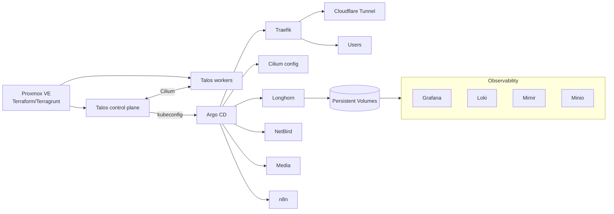

# Homelab Platform

Talos-based Kubernetes on Proxmox, provisioned with Terraform/Terragrunt, secured with Cilium and NetBird, and continuously reconciled through Argo CD. The repo is organized as a showcase of declarative infrastructure, app deployments, and day-2 operations for a self-hosted homelab.

## Architecture

- Proxmox VMs for Talos control plane and workers defined via Terraform/Terragrunt
- Talos machine secrets and configs rendered and applied directly from Terraform
- Cilium as the CNI; kubePrism enabled on nodes for side-channel API access
- GitOps with Argo CD root application that fans out to per-stack Applications
- Traefik ingress with Cloudflare Tunnel egress; Longhorn for distributed storage
- NetBird overlay for secure remote access and service-to-service connectivity
- Observability stack (Grafana, Loki, Mimir, Minio) and app suites (n8n, media)

## Highlights

- **End-to-end IaC:** Proxmox VMs, Talos secrets/configs, and bootstrap all delivered through Terraform/Terragrunt (`terraform/root.hcl`, `terraform/infrastructure/cluster.tf`).
- **Talos-first Kubernetes:** Control plane and workers pinned to Talos v1.12.0 and Kubernetes v1.35.0 with kubePrism enabled for sidecar API access.
- **GitOps everywhere:** Argo CD `root-app` pulls this repo and deploys Cilium, Traefik, Cloudflare Tunnel, Longhorn, NetBird, and app stacks (n8n, media, observability).
- **Ingress and egress:** Traefik as default ingress controller with ACME/Cert-Manager support; Cloudflare Tunnel publishes services without opening inbound ports.
- **Storage:** Longhorn installs with ingress exposed at `longhorn.rupan.dev` and tuned replica/ingress settings.
- **Networking:** Cilium CNI plus NetBird overlay for private connectivity across nodes and edge clients.
- **Ops automation:** Ansible playbooks for audits (`ansible/playbooks/audit.yml`), maintenance and updates (`ansible/playbooks/maintenance.yml`), and Talos health checks.
- **App suites:** Media stack (Radarr, Sonarr, Prowlarr, Lidarr, Navidrome, torrent tooling, Flaresolverr), automation via n8n backed by PostgreSQL, with AI/observability bundles.

## Repository Layout

- `terraform/` – Terragrunt-driven Proxmox + Talos provisioning, machine secrets, kubeconfig outputs, and supporting templates/files.
- `ansible/` – Inventory and playbooks for auditing, patching, Docker pruning, and Talos health verification.
- `bootstrap/` – Argo CD root application definition to hydrate the cluster from `apps/`.
- `apps/` – Argo CD Applications for platform services (Traefik, Cilium, Longhorn, NetBird, Cloudflare Tunnel) and app stacks (media, n8n, observability, AI).
- `infrastructure/` – Kubernetes manifests and Helm values per stack (argocd, cilium, cert-manager, cloudflare, media, n8n, observability, ai, etc.).

## Operating Model (at a glance)

1. Use Terragrunt in `terraform/` to create Proxmox VMs, generate Talos secrets/configs, apply them, and pull the kubeconfig.
2. Bootstrap Argo CD and apply `bootstrap/root-app.yaml` so it begins reconciling `apps/`.
3. Argo CD deploys platform layers (Cilium, Traefik, Cert-Manager, Cloudflare Tunnel, Longhorn) and app suites (media, n8n, observability).
4. Run Ansible playbooks for periodic audits and OS/Talos health checks across fleet nodes.

## Notes

- Sensitive values are expected in `secrets.tfvars` (kept outside VCS) and Kubernetes secrets; none are committed here.