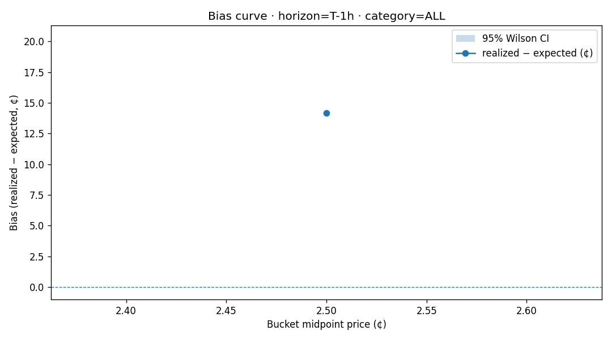
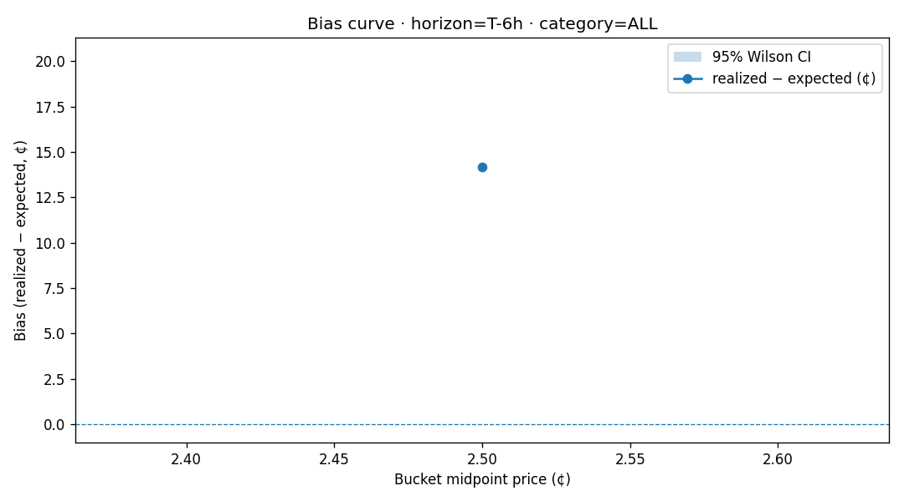

# Favorite-Longshot Bias — Report (2026-06-01)

## Summary

- Total resolved markets analyzed: **180**
- Breakdown by category:

  - `Climate and Weather`: 180

## Cross-horizon bias table (all categories combined)

| Bucket | T-7d | T-24h | T-6h | T-1h |
|---|---|---|---|---|
|  0- 5¢ | — | **+1417 bps** (n=180) | **+1417 bps** (n=180) | **+1417 bps** (n=180) |

## Suggested strategies

No bias pattern met the strategy threshold (≥200 bps, persistent at T-6h+, ≥1000 markets in category).

## Bias curves

### Horizon: T-1h

### Horizon: T-24h

### Horizon: T-6h

