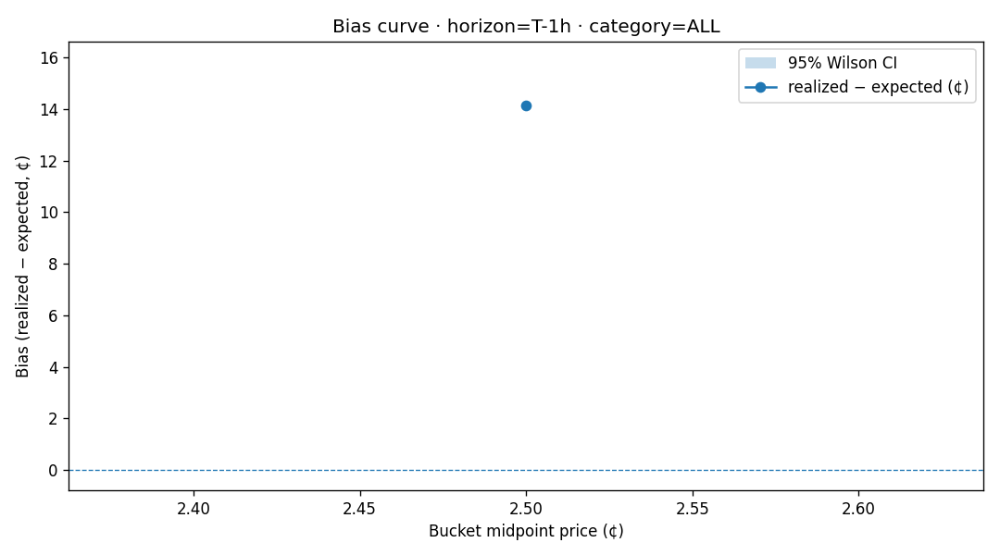

# Favorite-Longshot Bias — Report (2026-06-01)

## Summary

- Total resolved markets analyzed: **1978**
- Breakdown by category:

  - `Climate and Weather`: 1978

## Cross-horizon bias table (all categories combined)

| Bucket | T-7d | T-24h | T-6h | T-1h |
|---|---|---|---|---|
|  0- 5¢ | — | **+1413 bps** (n=1978) | **+1413 bps** (n=1978) | **+1413 bps** (n=1978) |

## Suggested strategies

### `Climate and Weather` bucket 0-5¢
Buy **YES** when price is in this bucket at any of ['T-24h', 'T-6h']. Persistent bias of +1413 bps across horizons with n≥1978 markets.

## Bias curves

### Horizon: T-1h

### Horizon: T-24h

### Horizon: T-6h

