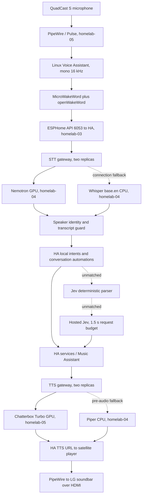

# Jarvis voice audit, 2026-09-23

## Scope and evidence

Read-only audit of repository revision `fb64e14bed4e3d2a8a273d58ed6a8a26be46089f`, its existing working changes, Kubernetes services and metrics, Home Assistant storage and entity states, the running satellite source, and homelab-05 audio services. Existing CAD and voice work was preserved. No services were restarted, devices actuated, or configuration deployed.

During the audit, another session committed the existing music-control changes as `eb85908cc3ea600d58bf383d594ec15da2d16ba6`. Those files were inspected too. Runtime observations are timestamped snapshots from the audit, not a claim that this later commit was deployed. Read-only HA template rendering confirmed the volume-expression defects below.

Both voice and Home Assistant Flux Kustomizations reported this revision ready. All ten running voice pods were ready with zero restarts. Gateway, Nemotron, Chatterbox, and Jev agent implementation bytes matched the inspected working source. This does not imply that every HA automation or existing uncommitted music change is applied.

The focused test command ran 127 tests successfully, with eight skipped because voice-ID dependencies were unavailable in the development Python environment:

```sh
nix develop ./flake -c python -m unittest tests.test_voice_gateway tests.test_nemotron_bridge tests.test_chatterbox_bridge tests.test_voice_id tests.test_jev_router tests.test_jev_l0 tests.test_jarvis_exporter tests.test_voice_topology tests.test_jarvis_voice_eval tests.test_home_assistant_voice_satellite_config
```

Additional local TCP fault injection used the real gateway implementation and fake backends. It demonstrated missing STT retry, no TTS response deadline, unchanged fallback voice, no circuit opening after three synthesis errors, and missing TTS gateway metrics. Evidence and captured satellite source are under `.agent-state/evidence/jarvis-audit-2026-09-23/`. These ignored files remain local.

No acoustic recordings, audible playback tests, unplug tests, or live backend failure injection were performed. AEC effectiveness, wake false-positive rate, physical action completion, and sustained load behavior therefore remain unmeasured.

## Actual architecture



The satellite uses the ESPHome API, not Wyoming. Wyoming connects HA to STT/TTS. The live selected Jarvis pipeline has `prefer_local_intents: true`, STT `stt.faster_whisper` at the stable gateway, TTS `tts.chatterbox_turbo`, voice `jarvis`, and the Jev agent. General conversation fallback is empty. There is no active general-purpose LLM. Groq STT, local-decision, and von-decision have zero replicas; Groq remains in the gateway preference list but is unavailable.

Live microphone settings: mono capture, volume 75, noise suppression High, AGC off, aggressive end-of-speech detection, thinking sound enabled, and two Hey Jarvis detectors at sensitivity 0.5. The default input is the physical QuadCast and output is onboard `pro-output-3`. The LG HDMI descriptor is currently valid. There is no configured playback-reference channel or PipeWire AEC module in this path.

## Measurements

| Observation | Current sample | Interpretation |
| --- | --- | --- |
| Nemotron post-audio-stop latency | 29 log turns, median 47 ms, maximum 71 ms | Excludes wake detection, speech duration, and HA endpointing |
| Gateway audio-stop to transcript | 29 events, about 52 ms mean | Confirms small post-speech backend delay in this sample |
| Chatterbox time to first audio | 6 syntheses, 11.645 s total, 1.94 s mean | Full waveform generation precedes first audio |
| Chatterbox audio produced | 14.48 s across those 6 syntheses | About 2.41 s audio per request; aggregate wall/audio ratio about 0.80, including queue time |
| Exporter completed turns | 26; 24 processing phases at most 2 s, 2 over 2 s | One phase exceeds 32 s; these counters do not identify its cause |
| Exporter listening mean | 3.34 s | Includes speaking and endpointing; not ASR compute |
| Exporter processing mean | 2.16 s | Includes long outliers; not pure LLM time |
| Exporter responding mean | 1.23 s | Not proof of audible completion |
| Satellite current resource use | 334 millicores, 185 MiB | Single snapshot, not a measured idle baseline |
| Chatterbox current RAM | 1,916 MiB | Largest voice pod in this snapshot |
| T600 total VRAM used | 3,276 / 4,096 MiB | Includes display and all GPU consumers; about 820 MiB spare |
| Exporter health | Authenticated, subscribed, fresh events | Previous disconnected-exporter condition is no longer present |
| Prometheus targets | Chatterbox down; exporter, gateways, Nemotron up | Chatterbox metrics work locally but scrape traffic times out |

Samples span different requests and process lifetimes. Do not add their averages into an end-to-end latency estimate or treat 26 completed state cycles as 26 successful physical actions.

## Bugs, ordered by impact

### B1. High: Piper fallback retains an invalid Chatterbox voice

**Evidence:** `gitops/voice/gateway/gateway.py:262` replays synthesis events unchanged. The active HA voice is `jarvis`. Live Piper code resolves explicit request voices before its default, and `find_voice("jarvis", ["/data"])` raises `VoiceNotFoundError`. Its installed voices include `en_GB-alan-medium`, not `jarvis`.

**Impact:** The fallback intended to preserve speech during Chatterbox failures also fails for the normal Jarvis voice request. Existing gateway tests use a fake fallback that ignores voice names and omit the voice field from requests.

**Fix:** Give the gateway a stable public voice and explicit backend voice mapping. Rewrite Piper requests to `en_GB-alan-medium`, including streaming request metadata. Add a protocol integration test with the actual pinned Piper backend and the HA request shape. Keep public discovery independent of whichever backend answers first.

### B2. High: STT fallback cannot recover an in-progress failed turn

**Evidence:** `gateway.py:292` chooses a backend once and forwards streams without retaining audio. It retries connection establishment only. Fault injection delivered the primary error to the client with zero fallback calls. `gitops/voice/nemotron-bridge/bridge.py:603` and `:650` convert native recognition failures to an empty transcript, indistinguishable from deliberate silence rejection.

**Impact:** A reachable but failing Nemotron silently loses commands even with healthy Whisper. An empty failure can be counted as a successfully returned transcript.

**Fix:** Buffer a bounded utterance in the gateway and retry once on explicit backend error, premature EOF, or recognition deadline. Emit a distinct Wyoming error for native failures; preserve empty transcripts for genuine silence or intentionally rejected garbage. Never replay an HA action, only the pre-intent audio.

### B3. High: Backend hangs evade deadlines, circuit breaking, and readiness

**Evidence:** `gateway.py:269` waits for backend events without a timeout. `connect_backend` resets failure counts on TCP success, and the health loop also resets them after successful TCP probes. Stream and synthesis failures never open the circuit. Three injected synthesis failures still selected the primary three times with failure count zero. Gateway `/healthz` is unconditional and used for readiness as well as liveness. Backend probes primarily test TCP accept.

**Impact:** A stuck inference process can hold turns indefinitely while every pod reports ready. Recovery repeatedly pays the failing primary cost. Readiness does not match the runbook's claim that an all-backends-down gateway becomes unavailable.

**Fix:** Add first-response, post-endpoint, idle-stream, and total-request deadlines. Drive circuit state from completed protocol outcomes, use a single half-open trial, and reset only after useful success. Distinguish process liveness from backend availability. Bound queues, concurrent requests, utterance size, text length, and Wyoming frame sizes. Cancel abandoned work; isolate native inference in a worker process where a stuck native call cannot be left running merely by cancelling an asyncio future.

### B4. High: New volume controls contain failing templates and incorrect percentage handling

**Evidence:** `home-assistant/automations/jarvis_music_volume.yaml` uses `value | max(0.0) | min(1.0)`. Rendering that exact expression shape through the live HA `/api/template` endpoint returns `TypeError: 'float' object is not iterable`. Rendering `0.0 | default(0.5, true)` returns `0.5`. The explicit-level branch divides by 100 only when the number exceeds 1.

**Impact:** Relative and explicit numeric volume requests fail during template evaluation. Once the clamp is repaired, raising volume from zero would start from 50%, and a request for 1 percent would map to full volume. Mute, unmute, minimum, and maximum use other branches and do not all share the clamp exception. Source deployment of the new automation was not assumed.

**Fix:** Clamp an iterable, for example `([0.0, candidate, 1.0] | sort)[1]`. Preserve zero with an explicit missing-value check or `float(0.5)` without the truthy-default filter. Define spoken numeric levels as percentages and always divide them by 100; reject unparseable levels instead of silently choosing 50%. Render actual templates in tests for zero, one, 50, 100, out-of-range values, and invalid input. Do not report `Done.` after a suppressed service error.

### B5. High: A dead microphone thread can leave the satellite green

**Evidence:** Running satellite commit `43a183a2322cde4c9e2558f333124941fdeaa439`, captured `satellite_main.py:541`, launches audio processing in a daemon thread. Its outer exception handler calls `sys.exit(1)` from that thread (`:831`), which exits the thread, not the server process. All satellite probes in `gitops/voice/satellite.yaml:65` use `pgrep`.

**Impact:** A recorder exception, including a device or PipeWire disruption, can permanently stop audio capture while the API, pod probes, and HA entity still look healthy. The unavailable-only watchdog may never fire.

**Fix:** Monitor audio-frame age and thread health from the main loop. Retry device enumeration and recorder creation with bounded backoff; terminate the process if recovery fails. Probe capture freshness and API responsiveness, not process existence. Verify with USB disconnect/reconnect and PipeWire restart tests during an authorized maintenance window.

### B6. Medium: The retained TTS mute automation uses a destructive mute operation

**Evidence:** `home-assistant/automations/jarvis_satellite_tts_mic_mute.yaml:11` has `initial_state: false`. Running satellite `satellite.py:487` stops TTS and streaming when the mute switch is enabled. The automation unmutes unconditionally on idle or HA startup, without preserving user mute intent. It was not present among the matching live automation entities inspected.

**Impact:** It is not an active echo safeguard. Enabling it can truncate speech and later undo a deliberate manual mute. HA state transitions also arrive too late to be a precise playback gate.

**Fix:** Retire this automation in favor of a satellite-local playback inhibition flag separate from user mute. Preserve manual mute across transitions. Gate ordinary wake detection for playback plus a measured acoustic tail, with a bounded recovery timer. Existing `_pipeline_active` already blocks ordinary wake requests during TTS; retain that behavior and test tail handling and stop-word behavior.

### B7. Medium: TTS observability is broken in two independent places

**Evidence:** `gitops/voice/network-policy.yaml` omits `wyoming-chatterbox` from `allow-prometheus-scrapes`; the live target times out while localhost metrics respond. `gateway.py:292` returns into `handle_tts` before creating `TurnMetrics`. The test exercises the metrics helper directly, not its real handler. Prometheus has no `jarvis_tts_time_to_first_audio_seconds_count` series.

**Impact:** TTS latency, fallback behavior, and synthesis failures are largely invisible precisely where the measured delay is largest.

**Fix:** Permit observability ingress on Chatterbox port 8001. Instrument actual TTS request and response paths, including attempted backend, queue time, first audio, failure, and completion. Use histograms for tails rather than only sum/count. Add scrape-down and all-backends-unavailable alerts and test metrics through real handlers.

### B8. Medium: HDMI recovery depends on the browser and misses stale audio descriptors

**Evidence:** `flake/hosts/homelab-05/default.nix:219` waits for a Chromium debug target titled exactly `JARVIS` before enabling the HDMI clock. The loop checks display mode/position, not ELD validity. It suppresses errors. Live service execution is overridden by `/run/systemd/system/satellite-hdmi-audio-clock.service.d/pos.conf`, running `/run/satellite-hdmi-clock.sh`; that script currently implements the same intended layout.

**Impact:** A face/auth/browser problem can block soundbar recovery. Correct display geometry does not prove the audio descriptor recovered after input switching. The runtime override adds reboot and deployment uncertainty even though audio routing and ELD are currently correct.

**Fix:** Start recovery when the compositor socket and DRM outputs are ready. Observe ELD, sink availability, and playback errors; use a rate-limited off/on modeset only for demonstrated descriptor failure. Log failed recovery. Reconcile the transient override into the declared service during the next authorized deployment.

### B9. Medium: Topology inspection reads the wrong HA storage object

**Evidence:** `scripts/voice_topology.py:123` searches `core.config_entries` for pipeline engine fields. The inspected live pipeline is stored in `.storage/assist_pipeline.pipelines`, and the actual agent domain is `jarvis_jev`. `check()` only validates a few desired-source invariants.

**Impact:** The generated report cannot substantiate the active pipeline engines or identify the stale alternative pipeline reliably. Live HA still contains an unused Piper integration pointing to `wyoming-piper.voice.svc.cluster.local`, while the current backend Service is `wyoming-tts-piper`.

**Fix:** Read pipeline configuration through the supported HA WebSocket API, resolve the satellite's selected pipeline and entity/config-entry identities, and compare them with intended stable endpoints. Report missing evidence as unknown. Flag stale integrations for explicit cleanup rather than silently replacing UI state.

### B10. Medium, latent: General-agent recursion protection compares only one identity

**Evidence:** `home-assistant/custom_components/jarvis_jev/__init__.py:112` rejects only `fallback_agent == self.entry.entry_id`. A conversation entity ID that resolves to the same entry can pass. No additional timeout encloses `async_converse`. Live fallback is empty, so this branch is currently dormant.

**Impact:** A later fallback configuration can recursively invoke Jarvis, consume repeated hosted requests, and stall the turn.

**Fix:** Resolve fallback IDs to registered agents, reject all aliases of self, track delegation depth, and apply a total deadline. Validate the target during configuration. General conversation being disabled today is deliberate, not an unexplained model outage.

## Optimizations, ordered by expected benefit

### O1. High: Reduce TTS work before tuning already-fast STT

**Evidence:** `gitops/voice/chatterbox-bridge/server.py:236` generates the entire waveform before returning PCM; `:395` serializes generation behind one lock. Dividing PCM into 250 ms network chunks does not make inference streaming. Six live syntheses averaged 1.94 s before audio.

**Impact:** Uncached acknowledgements and long replies incur full generation latency. A slow or abandoned request holds later requests behind it. GPU failure silently switches to CPU at `:214`, potentially preserving readiness with much worse latency.

**Fix:** Measure HA cache hit rate, warm common fixed acknowledgements, and key any extra cache by text, voice/reference hash, model revision, and settings. Use Piper for short deterministic acknowledgements if the voice tradeoff is acceptable. For novel long replies, evaluate sentence generation or a genuinely streaming engine while preserving cancellation and bounded queues. Expose CPU fallback explicitly, or fail into Piper instead. Do not reduce `chunk_ms` expecting faster first audio.

### O2. Medium: Run one wake detector unless two provide measured value

**Evidence:** Live preferences enable both MicroWakeWord Hey Jarvis and openWakeWord Hey Jarvis. The processing loop runs both feature paths. The satellite uses about one third of a CPU core in the observed snapshot.

**Impact:** Duplicate inference consumes CPU and combines opportunities for false activation. No recorded acoustic suite establishes an accuracy benefit.

**Fix:** Compare each detector separately on the same near/far speech, music, TV, and silence recordings. Keep the one meeting recall and false-wake targets. Evaluate High noise suppression separately from AGC and mic gain. The capture block is 1,024 samples at 16 kHz, about 64 ms; only lower it after measuring latency versus CPU overhead.

### O3. Medium: Remove avoidable work from the Whisper fallback path

**Evidence:** `gitops/voice/voice-id/proxy.py:326` performs synchronous speaker inference before forwarding `audio-stop`. It blocks that process's asyncio loop. Whisper uses beam size 5. Nemotron already overlaps final recognition with threaded speaker inference.

**Impact:** Fallback finalization cannot start until speaker identification finishes, and simultaneous clients share the stall. Voice identity is computed even for commands that never use the speaker prefix.

**Fix:** Forward `audio-stop` immediately, run identity inference in a bounded worker, and merge results with a deadline. Skip or bypass identity when not needed without losing music personalization. Benchmark Whisper beam 1 against beam 5 using entity/action accuracy, especially proper nouns, before changing the default.

### O4. Low: Bound metrics memory and vectorize PCM conversion

**Evidence:** `chatterbox-bridge/server.py:263` appends every observation forever; rendering sums the full history. `:246` converts NumPy audio to a Python list, then makes another list for normalization and packs samples one at a time.

**Impact:** Memory and scrape cost grow with uptime, with unnecessary allocation and CPU work per synthesis. This is secondary to model generation at current traffic.

**Fix:** Store running sums/counts or bounded histogram buckets. Normalize, clip, round, and convert to little-endian int16 in NumPy. Test clipping and rounding against the existing conversion contract.

### O5. Low: Restrict face subscriptions to the entities it displays

**Evidence:** `home-assistant/www/jarvis/app.js:545` fetches all HA states and subscribes to every `state_changed` event, although display updates depend on three configured entities. The exporter also consumes the global bus.

**Impact:** Unrelated HA activity incurs network traffic, JSON parsing, and retained state in the kiosk. The face has no application heartbeat deadline for a connection that remains open but stops delivering useful events.

**Fix:** Subscribe to the satellite, mute, and media entities through the HA entity subscription API, retain only those states, and add heartbeat/reconnect deadlines. For the exporter, use pipeline events and context IDs rather than expanding global traffic.

## Architectural improvements, ordered by impact

### A1. High: Make the audio endpoint own capture, playback, and recovery

The current endpoint spans a privileged host-network pod, a user PipeWire socket, USB mic, HDMI soundbar, compositor, browser readiness, HA automations, and systemd recovery. There is no configured AEC reference. High noise suppression is not echo cancellation. Wake chimes are intentionally captured during listening, and ordinary wake detection becomes eligible immediately after normal playback completion.

Keep capture and playback arbitration in one endpoint state machine: manual mute, turn-active state, playback inhibition, tail delay, cancel, and reconnect. First establish reliable half-duplex operation. Full duplex requires a measured reference-aligned AEC path, with tests during loud playback and across device clock drift. Two raw QuadCast channels are not a microphone-plus-playback reference. Preserve local wake detection and stream only active turns.

Evaluate a native NixOS user service for the satellite because its lifetime is fundamentally tied to the local audio session. Alternatively, retain Kubernetes with explicit device recovery and sharply reduced privileges. The current privileged container plus host socket mount is broader than the demonstrated Pulse client requirement; validate a reduced-permission deployment before removing access.

### A2. High: Design failure domains around hosts, not replica counts

Both Nemotron and its only active Whisper fallback are pinned to homelab-04. Groq has zero replicas. Losing homelab-04 removes all active STT despite two gateway replicas. Gateway deployments have no placement spread or disruption budget, so their current distribution is not guaranteed. Chatterbox shares homelab-05 with the microphone, kiosk, and HDMI output.

Move the CPU STT fallback to another suitable host with its model present. Add topology spread or anti-affinity for gateway replicas and an appropriate disruption budget. Keep backend selection local and observable. Remove disabled backends from the active preference order until intentionally enabled. Exercise node loss, backend hang, and DNS failure, not just graceful TCP refusal. Do not add more gateways expecting them to repair shared backend failure.

### A3. Medium: Build reproducible inference artifacts and simplify ownership

Nemotron depends on untracked host-installed native libraries, a staged Nix glibc loader, and a host model. An ordinary `cat` inside its container currently fails with a `GLIBC_PRIVATE` symbol error because `LD_LIBRARY_PATH` mixes runtimes; invoking the matching loader works. Chatterbox installs packages during init, copies model caches, and decides whether to download based on a snapshots-directory existence check rather than integrity of the exact pinned snapshot.

Build versioned inference images or Nix closures containing the matching loader, libraries, locked Python dependencies, and code. Check model revisions and required file hashes explicitly; use atomic cache preparation. A pinned base-image digest does not pin manually installed host libraries or future dependency resolution. Avoid duplicating multi-gigabyte caches where one mounted verified cache suffices.

HA routing also has overlapping grammars in custom sentences, conversation automations, L0 parsing, and Jev target evidence. Keep HA local intents first, consolidate target/action metadata and sentence tests, and let semantic routing handle genuinely unmatched language. Preserve Jev's current closed target vocabulary, range checks, and confidence gates. Keep UI-owned pipeline selection observable and backed up rather than hand-editing storage. Refresh the runbook's obsolete PVC, Wyoming-satellite, and pending-mute statements.

### A4. Medium: Measure a complete turn and test failure behavior

Exporter timing is based on satellite phases. It attributes any HA service call during processing to Jarvis, without matching context. Twenty-five of 26 completed turns have unknown room attribution. A transition back to idle after responding increments success even if playback or physical device control failed. The music script similarly returns `status: playing` after service submission without observing playback. Its `mode: restart` can interrupt a multistep queue update when another command arrives.

Use a correlation ID across pipeline events, backend requests, HA context, and playback acknowledgements. Record wake-to-first-speech, end-of-speech-to-first-audio, action submission, action confirmation where available, timeout stage, cache hit, and cancellation. Label phase metrics as phases. Set bounded state-confirmation waits for actions where correctness matters, and distinguish accepted requests from verified effects. Treat music queue replacement as a serialized operation or suppress stale completions.

Build the missing `tests/acoustic/manifest.json` and private recordings referenced by the runbook. Cover quiet/far speech, music, TV, wake chimes, echo tails, clipped endings, speakers, unknown speakers, and silence. Add real protocol tests for voice mapping, discovery, hung backends, malformed frames, disconnects, and resource limits. Existing passing tests do not exercise these combinations; some explicitly accept native failures becoming empty transcripts.

## Recommended order

1. Repair Piper voice mapping, STT error signaling/replay, request deadlines, circuit accounting, and volume templates.
2. Detect and recover dead audio capture; replace the unsafe mute automation with local playback inhibition.
3. Restore TTS metrics and alerts, then establish correlated end-to-end latency and acoustic baselines.
4. Optimize acknowledgements and wake detection using those baselines.
5. Separate host failure domains and package reproducible inference runtimes.

Protocol references: [Wyoming protocol](https://github.com/OHF-Voice/wyoming), [Home Assistant Assist pipeline events](https://developers.home-assistant.io/docs/voice/pipelines/). The latter provides distinct STT, intent, TTS, and pipeline error events suitable for direct instrumentation.
