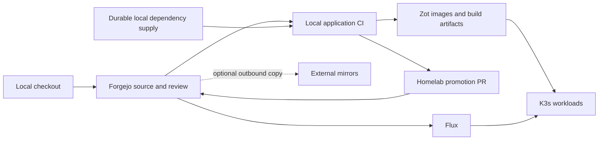

# Project sovereignty landscape, 2026-10-08

The homelab has a local infrastructure control plane, but most first-party applications still depend on GitHub for source authority and CI orchestration. Zot adoption has moved deployment artifacts locally without moving the complete production process. The next step is application Git and CI migration, followed by dependency supply and recovery proof.

## Scope and evidence

This is an observational audit, not a migration or deployment. It inspected Git repositories under `/home/rupan/projects` and `/home/rupan/businesses`, plus `/home/rupan/homelab`, `/home/rupan/nixos`, and `/home/rupan/obsidian`. Repository discovery stopped at each Git root and excluded generated dependencies, vendor directories, symlinks, and hidden worktrees. It is not an inventory of every repository on every disk or every remotely hosted GitHub project.

Source inspection covered workflows, Dockerfiles, registry inventory/lock, CI policy, Flux entrypoints, automation, secret-store configuration, ingress, and backups. Live read-only observations used SSH to nas-01, homelab-04, and homelab-01; SQLite connections used `mode=ro`. Kubernetes Secret values were not collected. Local task evidence is under `.agent-state/evidence/project-sovereignty-audit/` and is ignored by Git.

The workspace changed concurrently. Initial homelab HEAD was `b3e4efcb7098e4f0150c1c5599c3aedde825f7ac`; a later source read was at `7f085ef5311fca1f96324b6fac4c666eb559e489`. Forgejo main and Flux were separately observed at `8f832a0d3d1e29137ee9c6527367640d9d9af201`. The selected primary-source files were retrieved through authenticated read-only Forgejo APIs and saved separately. These identities are observations, not a claim that all source and hosts were synchronized.

Discovery found 43 local Git roots: 32 with at least one GitHub remote, 10 without remotes, and one with Forgejo as origin. Twenty-six had local changes when inventoried. These counts include infrastructure, experiments, and upstream checkouts, not just hosted applications.

## Existing platform

| Layer | Observed state | Sovereignty implication |
| --- | --- | --- |
| Git authority | Forgejo 15.0.7 on nas-01; SQLite in `/persist/forgejo/data`, repositories in `/tank/forgejo/repositories` | Local, but its database contains only `JEFF7712/homelab` |
| Infrastructure CI | Woodpecker server, policy, sandbox, trusted, and deploy agents active on homelab-04 | Local; one active repository, `JEFF7712/homelab` |
| Application CI | 15 GitHub runner deployments Ready in Kubernetes; two NixOS GitHub runner services active on homelab-04 | Execution is local; source checkout, scheduler, runner registration, workflow actions, and stored CI secrets still depend on GitHub |
| Container artifacts | Native Zot active on nas-01; `/tank/registry`, 79.4 GiB allocated in the observed ZFS listing | Local first-party and upstream image supply exists; complete cold-pull availability is a separate acceptance test |
| Nix artifacts | Attic active on nas-01; `/tank/attic`, 31.8 GiB allocated | Local substitution exists, but flakes, uncached outputs, and source fetches can still require external services |
| GitOps | Flux GitRepository uses Forgejo SSH; 21 Kustomizations observed Ready after reconciliation | Already local Git authority for deployments |
| Helm supply | Nine live HelmRepository objects point to external chart servers | Fresh chart fetches and recovery still depend on external servers |
| Secrets | One Ready ClusterSecretStore reads Kubernetes `secret-source`; 20 ExternalSecrets Ready | Current application secret distribution is local, not GitLab-backed |
| Infrastructure state | Local TLS OpenTofu state service and Garage declared; Garage active on NAS | Existing local state and artifact services should be retained |
| Public access | Cloudflare Tunnel routes websites and services; Git and registry have internal paths | Public access remains dependent on Cloudflare |
| Certificates | Git, Zot, and declared npm endpoint use ACME with Cloudflare DNS-01 | Existing certificates work locally; issuance and renewal require external services |
| Backups | NAS and homelab-04 platform backup services last completed successfully; Zot backup completed successfully | Successful jobs are current observations; restore capability was not retested in this audit |

The NAS also supplies NFS-backed cluster storage. Consolidating Git, registry, caches, and state here creates a common failure domain. Its observed ZFS pool had 6.90 TiB available; that shows storage headroom, not measured CI capacity or redundancy. The independent backup disk had approximately 1.7 TiB free.

The normal homelab CI runs GitHub mirroring after validation. GitLab is an explicit disaster-recovery lane, disabled by default, rather than the normal scheduler. External mirrors can remain optional copies, but their failures should not prevent local delivery if local autonomy is the goal. A same-rack backup alone does not protect against site loss.

## Hosted first-party project map

The 15 website deployments were all available at observation time. Every website deployment referenced `registry.rupan.dev/apps/...` with a digest. This proves the configured consumer path and replica availability, not complete application behavior.

| Hosted workload | Owning source found | Current delivery path and remaining dependency |
| --- | --- | --- |
| rupan.dev | `/home/rupan/projects/sites/rupan.dev`, GitHub `JEFF7712/rupan.dev` | GitHub-hosted quality CI plus self-hosted image CI to Zot; GitHub Actions cache; local pinned base images and npm endpoint declared |
| rupanism | `/home/rupan/projects/sites/rupanism`, GitHub `JEFF7712/rupanism` | GitHub quality CI and self-hosted image publication to Zot; local pinned bases; npm endpoint declared |
| ISM | `/home/rupan/projects/sites/isms`, GitHub `JEFF7712/ism` | Self-hosted GitHub publication to Zot; Dockerfile still uses public Node base and npm |
| Nix Agent site | `/home/rupan/projects/nix-agent`, GitHub `JEFF7712/nix-agent` | GitHub quality CI; self-hosted site publication to Zot; workflow opens a Forgejo homelab promotion PR; public bases/pnpm and GitHub build cache remain |
| Pulse site | `/home/rupan/projects/pulse`, GitHub `JEFF7712/pulse` | Site image publishes locally; package tests/releases still use hosted GitHub CI, PyPI, and GHCR; site Dockerfile uses public Node/nginx and npm |
| Majorfinder | `/home/rupan/projects/majorfinder`, GitHub `JEFF7712/majorfinder` | Zot publication plus a separate Cloudflare Wrangler workflow; public bases/npm remain; external deployment workflow presence does not prove it is active |
| Photography | `/home/rupan/projects/photography`, GitHub `JEFF7712/photos` | Zot publication plus a separate Cloudflare Wrangler workflow; public nginx base remains |
| Spatia site | `/home/rupan/projects/spatia`, GitHub `JEFF7712/spatia` | Site publishes to Zot; public nginx and Google Fonts remain; backend/iOS source also exists, but the homelab deployment found serves the site only |
| Sovereign site | `/home/rupan/projects/sovereign`, GitHub `JEFF7712/sovereign` | Site publishes to Zot; public nginx and Google Fonts remain; separate inquiry service in homelab stores SQLite locally and notifies local ntfy |
| Apolline | `/home/rupan/businesses/apolline/apolline-site`, GitHub `JEFF7712/apolline-site` | Self-hosted GitHub publication to Zot; public nginx base and GitHub cache remain |
| Darkbit | `/home/rupan/businesses/darkbit/darkbit-site`, GitHub `JEFF7712/darkbit-site` | Self-hosted GitHub publication to Zot; public nginx base and GitHub cache remain |
| DistroJeff | `/home/rupan/businesses/distrojeff/distrojeff-site`, GitHub `JEFF7712/distrojeff-site` | Self-hosted GitHub publication to Zot; local pinned bases/npm endpoint declared; GitHub build cache remains |
| Soluble | `/home/rupan/projects/old/soluble`, GitHub `JEFF7712/solubility-predictor` | Self-hosted GitHub publication to Zot; PyTorch and PyG wheel servers are explicit build dependencies |
| CR demo | No authoritative project checkout located in inspected roots | Local `apps/cr-demo` consumer exists; source, producer workflow, and reproducible build need discovery before migration |
| Bus display | Backend in homelab `services/bus-display/`; firmware in `/home/rupan/projects/bus-route-display` | Backend source already local via homelab; Dockerfile uses public Python/PyPI; standalone firmware Git root has no remote and no commit SHA reported; live transit and Outlook calendar remain external inputs |
| Quartz notes | `/home/rupan/obsidian`, GitHub `JEFF7712/obsidian-vault`, with Quartz upstream remote | Local Zot publication through GitHub runner; local pinned bases/npm endpoint declared; GitHub build cache, Debian apt, plugin Git clones, and documented browser Mermaid CDN remain |
| Bookshelf | No durable checkout located in inspected roots; configured runner targets GitHub `JEFF7712/bookshelf` | Local media deployment uses `apps/bookshelf`; prior runbook identifies producer branch `develop`, requiring fresh verification |
| Pod Agent | `/home/rupan/businesses/pod-agent`, GitHub `JEFF7712/pod-agent` | Hosted GitHub quality job, self-hosted image job publishes Zot and GHCR; base images now local, but apt, npm, PyPI and downloaded agent CLIs remain |
| NixOS config | `/home/rupan/nixos`, GitHub `JEFF7712/nixos-config` | Two local GitHub runners; GitHub workflows for checks, toplevel builds and ISO publishing; flake inputs and uncached source/artifact supply remain external |

Homelab also owns first-party automation and voice source, including the Nemotron/Chatterbox bridge directories and Renovate tooling. Their local images do not imply model weights, tool downloads, or every build dependency are durably mirrored. The registry inventory itself explicitly reports producer-pipeline provenance as unproven for first-party images; some `producer.location` fields retain historical external registry identities.

Other local repositories with GitHub remotes include NaviSync, apptlyAI, autocompress, cctop, music-ai, navispot, predmarkbot, resume-agent, roku-bulb-local, and spotify-clone. No matching hosted deployment was established for these in the inspected workload inventory. They should not be bulk-migrated as production services solely because a checkout exists.

Repositories without remotes were bus-route-display, evolveAI, intentd, jepa, job, music, sites/sf, sites/tree, startups, and uwagent. They need an independent source backup decision. Existing local edits must be preserved separately from committed histories.

## Remaining dependencies by failure mode

### Source and CI authority

Changing `origin` alone will not move application delivery. Current workflows rely on GitHub events, context variables, third-party actions, hosted runners, secrets, release APIs, and `type=gha` build caches. New Forgejo repositories also require branch protection, webhooks, CI enrollment, scoped publisher identities, and transfer of issues, PR history, releases, LFS objects, and wiki data where present. Ordinary Git transport does not transfer all of that platform metadata.

The existing Woodpecker policy is an exclusive server-owned configuration extension. `scripts/ci/policy.py` checks Woodpecker repository ID 1, owner JEFF7712, and name homelab, rejecting other repositories. Its normal validation command is homelab-specific. Applications cannot simply add `.woodpecker.yml` and use this server unchanged. Production operation authorization must remain separate from application test/build/publish rights.

Renovate has both Forgejo and GitHub paths. Application discovery/review/approval is still GitHub-oriented, while the Forgejo infrastructure allowlist contains only homelab. Move these integrations together with each project, rather than leaving dependency PRs and approval commands pointed at the old authority.

### Build and dependency supply

There are three distinct properties: local artifacts for running an existing release, ability to rebuild a locked release without upstream access, and ability to discover/import new upstream releases. The first is substantially implemented; the second is incomplete; the third naturally requires upstream contact unless updates arrive through another controlled import channel.

The npm cache is declared in `flake/modules/npm-cache-proxy.nix`. It proxies `registry.npmjs.org`, caches tarballs, has bounded retention/eviction, and is documented as excluded from backups. Several Dockerfiles now set `npm_config_registry=https://npm.rupan.dev`. During live probes, npm DNS on homelab-04 resolved publicly, the public endpoint returned HTTP 302, and direct verified HTTPS to nas-01 failed hostname certificate validation. The NAS ZFS listing did not include `tank/npm-cache`, and nginx's observed unit referenced only Git and registry certificates. Treat this as source work awaiting live acceptance. Even after activation, a disposable pull-through cache is not a durable, complete offline package mirror.

Cold builds also require npm/pnpm/bun archives, Python wheels and build dependencies, Debian/Alpine packages, Go modules where used, Nix flake inputs and source closures, Git plugins, and downloaded toolchain binaries. Lockfiles constrain versions; they do not preserve the bytes. npm lockfile resolved URLs and package-manager routing must be tested from the actual build environment.

Live workload templates included four external image names: CoreDNS, metrics-server, CloudNativePG operator, and the Music Assistant bgutil sidecar. On homelab-01, CoreDNS and metrics-server had explicit local registry rewrites, and k3s ran with `--disable-default-registry-endpoint` and `--embedded-registry`. External image spelling alone does not prove an external pull. The observed rewrite list did not include the CNPG operator or bgutil repositories; these need local supply checks. This sample did not enumerate every operator-created Pod image or init container or verify all five nodes' registry configuration.

Nine external Helm chart sources are independent of local container images: CNPG, external-secrets, Grafana, Helmforge, Jetstack, NFS provisioner, Prometheus community, Renovate, and Stakater. Local source-controller artifacts help existing reconciliations, but do not establish complete chart supply after a cold recovery.

### Runtime, networking, and recovery

Most hosted sites execute locally, but Cloudflare Tunnel remains their public ingress. Internal Forgejo SSH and registry paths already avoid that public route. Internal DNS fallback and certificate renewal must be assessed separately from current certificate validity. Full public autonomy would additionally require an ingress/DNS/connectivity design and an alternative to Cloudflare Access if its authentication behavior is retained.

Application-specific external inputs are separate from hosting sovereignty. Pod Agent integrates with Etsy, Printify, Discord and external agent/model providers. Spatia backend source uses Anthropic, but that backend was not established as deployed here. Bus display consumes Madison Metro feeds and Outlook calendar data. These can have local storage, queues, export and degraded operation, but moving Git does not make the external services local. Spatia and Sovereign still fetch Google Fonts in inspected site source.

R2 is explicitly used for database-dump backups. Platform backups are configured for encrypted offsite Restic, while registry backup has an independent local disk. Decide whether external encrypted backup is an optional disaster-recovery copy or must be replaced by another independently located machine you control. Do not reduce physical recovery independence merely to put every backup in the rack.

## Current operational observations and limits

- Four nodes were Ready; homelab-03 was NotReady. This pre-existing fault was not changed.
- All 15 website deployments, Quartz, the three observed Pod Agent deployments, and all 15 Kubernetes GitHub runners had available replicas.
- One bounded Flux check showed all 21 Kustomizations Ready at `8f832a0d3d1e29137ee9c6527367640d9d9af201`; the final captured check had 20 Ready and flux-system reconciling during concurrent changes. Twenty ExternalSecrets were Ready in the JSON inventory.
- Linux voice assistant had zero available replicas, and two older Pod Agent planner-recovery jobs were in Init:Error. No recovery was attempted.
- Woodpecker had successful branch/PR pipelines, running main/cron pipelines, and recent failed main/cron pipelines. Service availability is not a claim that current main CI is green.
- NAS platform backup last completed successfully at 01:04:13 CDT, homelab-04 platform backup at 01:01:26 CDT, and registry backup at 00:36:38 CDT on October 8.
- An authenticated registry manifest HEAD probe from homelab-01 timed out before producing a complete report. Zot service availability and existing running workloads therefore do not establish fresh manifest or blob availability in this audit.
- No WAN-denial test, fresh-runner build, isolated restore drill, full registry blob verification, or end-user website test was performed. Historical migration restore evidence informed investigation, but was not substituted for fresh acceptance.

## Recommended target and sequence

Keep the existing division of ownership: Forgejo owns source/review, Woodpecker owns CI scheduling, Zot owns OCI artifacts, Attic owns Nix substitutes, and Flux owns cluster deployment. Keep homelab as the GitOps authority and application repositories as their source authorities. Application publishers should produce verified immutable artifacts; deployment changes should enter homelab through protected promotion PRs.

1. **Establish a versioned project catalog.** Record authoritative repository, branch, source directory, checks, Dockerfile/context, output artifact, publisher identity, deployment owner, runtime inputs, and backup/restore obligations. Discover CR demo and Bookshelf before promising complete migration coverage. Refresh the audit against the selected primary revision before implementation because concurrent changes are ongoing.
2. **Create an application CI lane.** Prefer using the existing Woodpecker platform, with an explicit repository catalog and application-specific validation/build policy. Retain the infrastructure deployment boundary. A separate application Woodpecker instance is an alternative if policy isolation or lifecycle independence outweighs the operational cost. Forgejo Actions is another architecture choice, but adding it merely to preserve GitHub YAML would introduce a second CI platform and still require local actions, tools and cache supply.
3. **Migrate a simple site end to end.** Apolline or Darkbit is a suitable pilot: source transfer, local origin, Forgejo protection/webhook, local validation/build, scoped Zot publishing, promotion PR, Flux rollout, and functional verification. Then migrate the other sites, Quartz, NixOS, and finally applications with substantial integration and runtime dependencies. Preserve unrelated local edits and migrate Git metadata deliberately.
4. **Close cold-build dependencies.** Activate and verify the declared npm endpoint, then preserve complete locked dependency sets durably. Replace GitHub Actions cache with local registry/filesystem caching; mirror base images and tool downloads; retain Nix source closures and substitutes; provide Python wheel supply and required OS packages. Existing moving run-number image tags need an explicit transition so promotion ordering does not regress or collide after scheduler migration.
5. **Close cold-deployment and recovery dependencies.** Mirror chart versions and required models; audit operator images, init containers and k3s system images; maintain local secret/key recovery; make external mirrors non-blocking; define internal ingress and the intended Cloudflare boundary. Expand backup coverage to imported Forgejo metadata and artifacts.
6. **Prove autonomy in an isolated environment.** With empty runner caches and external forge/registry/package endpoints denied, clone from Forgejo, validate, build from locked local dependencies, publish to Zot, merge a protected promotion PR, deploy, and test the application. Separately recreate Git/CI/Flux and restore data from backups. Use isolated denial tests rather than disabling internet access for the production homelab.

Forgejo has native npm, PyPI and generic package publication support, which can host your own packages; it should not be assumed to provide a complete upstream dependency mirror without a tested import strategy. See [Forgejo package registry documentation](https://forgejo.org/docs/latest/user/packages/). Flux supports OCI sources with digest selection and Helm chart layers, providing a path to local chart supply. See [Flux OCIRepository documentation](https://fluxcd.io/flux/components/source/ocirepositories/). These are architectural options, not implementations deployed by this audit.

## Evidence index

| Evidence | Location |
| --- | --- |
| Local repository paths, remotes, branches, SHAs, dirty counts and CI files | `.agent-state/evidence/project-sovereignty-audit/local-repositories.json` |
| Selected live Kubernetes resource inventory without Secret contents | `.agent-state/evidence/project-sovereignty-audit/live-cluster.json` |
| Forgejo repository inventory from read-only SQLite | `.agent-state/evidence/project-sovereignty-audit/nas-01-inventory.json` |
| Woodpecker repository and recent pipeline inventory from read-only SQLite | `.agent-state/evidence/project-sovereignty-audit/homelab-04-inventory.json` |
| Observed primary revision and recent commits | `.agent-state/evidence/project-sovereignty-audit/primary-head.json` |
| Selected source files retrieved from that primary revision | `.agent-state/evidence/project-sovereignty-audit/primary-source/` |
| Final bounded Flux and node observations | `.agent-state/evidence/project-sovereignty-audit/flux-final.txt`, `nodes-final.txt` |

The source ownership references are [AGENT_MAP](../../AGENT_MAP.md), [CI pipelines](../runbooks/ci-pipelines.md), [local registry](../runbooks/local-registry.md), [Forgejo disaster recovery](../runbooks/forgejo-disaster-recovery.md), and [Cloudflare tunnel](../runbooks/cloudflare-tunnel.md). Evidence is a timestamped snapshot, not an ongoing health assertion.
