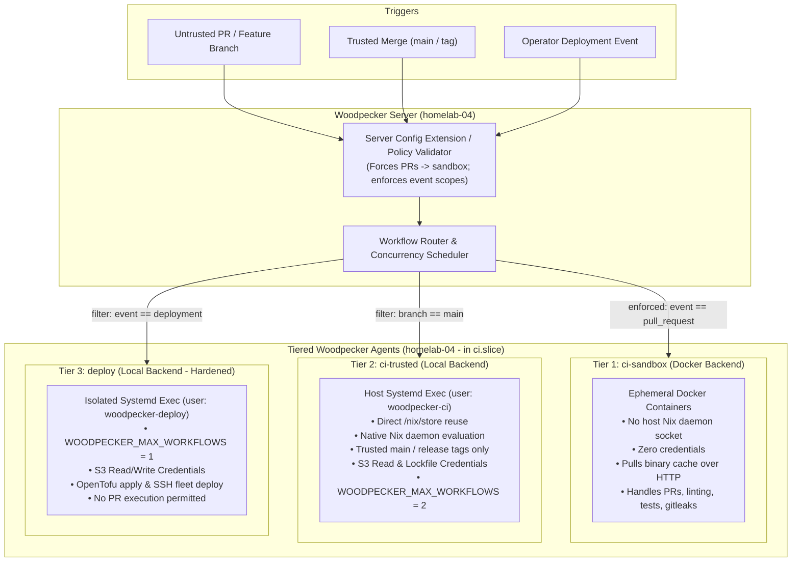

# Implementation Plan: Sovereign Git & CI Migration (Forgejo + Woodpecker CI)

Date: 2026-09-30
Status: Production Architecture Specification (Sovereign S3 Edition)
Scope: Replaces GitLab.com SaaS primary hosting and [.gitlab-ci.yml](../../../.gitlab-ci.yml) with a self-hosted Forgejo + Woodpecker CI stack, backed by an offsite GitLab.com disaster recovery mirror, a self-hosted S3 state store on `nas-01` with cloud DR backup, and server-enforced multi-tier runner execution.

---

## 1. Executive Summary & Core Requirements

The objective is to achieve local data sovereignty, LAN-speed git/CI operations, and offline resilience for the homelab without incurring the 4–8+ GB RAM penalty of self-hosted GitLab Omnibus, and without depending on external cloud providers (like AWS) for day-to-day operations.

### Strategic Goals
1. **Lightweight Infrastructure:** Deploy **Forgejo** (~150 MB RAM, SQLite on ZFS), **Woodpecker CI** (~50 MB RAM), and a lightweight **self-hosted S3 service (Garage/MinIO)** on existing hardware.
2. **Server-Enforced Runner Security Boundary:** Guarantee that untrusted pull-request code cannot compromise the CI host, self-assign host-local execution, steal deployment credentials, or mutate infrastructure.
3. **Feature Parity with Existing GitLab CI:** Completely replace the 1,456-line [.gitlab-ci.yml](../../../.gitlab-ci.yml), including:
   - Full migration of all **12 concurrency resource groups** across 25 declarations using Woodpecker native concurrency groups.
   - Controlled promotion for **18 manual deployment gates** using Woodpecker deployment events and approval flows.
   - Cross-workflow artifact passing for OpenTofu plans (`opnsense` and `cloudflare`) using the local S3 artifact store with provenance verification.
   - Modernized GitHub mirror synchronization (`scripts/ci/mirror.sh`) with README warning header transform.
4. **Sovereign Dual OpenTofu State Storage with Cloud DR Backup:**
   - **Primary:** Self-hosted S3 service running on `nas-01` backed by ZFS `tank` (native S3 locking with `use_lockfile = true`, OpenTofu 1.10+).
   - **Cloud DR Backup:** Automated encrypted offsite sync of state snapshots so state remains accessible if `nas-01` is offline.
5. **Safe Disaster Recovery Topology:** Implement a single-writer push-mirror to GitLab.com with an explicit failover/recovery runbook that prevents Forgejo from force-overwriting emergency GitLab commits upon restore.

---

## 2. Infrastructure Topology, Systemd Slicing, & Trust Boundaries

### Host Placement
* **Storage Host (`nas-01` - `10.0.30.20`):** Jonsbo N2 (Ryzen 5600G, 16 GB ECC RAM). Hosts:
  - **Forgejo** on ZFS dataset `tank/data/forgejo` (SQLite, `git.internal:2222`).
  - **Self-Hosted S3 Service (Garage / MinIO)** on ZFS dataset `tank/data/s3` (`s3.internal:3900`).
  - Zot container registry (`registry.rupan.dev`), local Nix binary cache (`http://10.0.30.20:8080/homelab`), and system audio stack.
* **CI Host (`homelab-04` - `10.0.30.14`):** Dell Precision 3460 SFF (Intel Core i5-13600, 14C/20T, 32 GB DDR5 RAM, 1 TB NVMe). Runs Woodpecker Server and three tiered agents.

### Unified Resource Management via Systemd Slice
To prevent the three Woodpecker agents and server from each claiming independent resource budgets and crowding out the k3s GPU worker, Monero node, or GitHub runners, all Woodpecker units run inside a shared systemd slice:
```nix
# flake/modules/woodpecker-host.nix
systemd.slices."ci" = {
  sliceConfig = {
    MemoryMax = "12G";
    CPUQuota = "800%";
    CPUWeight = 50;
  };
};
```
All Woodpecker systemd services declare `Slice = "ci.slice"`.

---

### Three-Tier Runner Trust Architecture & Server-Side Enforcement

Because workflow labels in `.woodpecker/*.yaml` are repository-controlled, **agent labels alone are not a security boundary**. A malicious PR could craft a workflow requesting `labels: { tier: deploy }` to gain host-level code execution.

To eliminate this vulnerability:
1. **Server-Side Configuration Enforcement:** Woodpecker Server runs an internal configuration extension / webhook validator (`WOODPECKER_CONFIG_SERVICE_ENDPOINT`). For any pipeline triggered by `pull_request` or untrusted branches, the server overrides/enforces agent selection to `tier: sandbox` regardless of what is requested in the repo's YAML.
2. **Event-Scoped Secrets:** No secrets exist for `pull_request` events. Production deployment secrets are strictly restricted to `events: [deployment]`.
3. **Agent Hardening:**
   - `ci-sandbox` runs the Docker backend with `trusted_network = false`, `trusted_volumes = false`, and `trusted_security = false`. It **never mounts the host Nix daemon socket**.
   - `ci-trusted` and `deploy` run as distinct unprivileged system users (`woodpecker-ci` and `woodpecker-deploy`) with no persistent production credentials on disk.



### Credential Specification per Trust Tier

| Agent Tier | Backend | User / Isolation | Allowed Events | S3 & Target Credentials |
| :--- | :--- | :--- | :--- | :--- |
| **`ci-sandbox`** | Docker / Podman | Containerized | `pull_request`, feature branches | **Zero secrets.** Evaluates formatting, unit tests, YAML lints, and secret scans. Pulls Nix HTTP cache (`http://10.0.30.20:8080/homelab`). |
| **`ci-trusted`** | Local / Exec | `woodpecker-ci` | `push` on `main`, release tags | **Planning Identity:**<br/>• S3 State Bucket: `GetObject`, lockfile `PutObject`/`DeleteObject`<br/>• S3 Artifact Bucket: `PutObject` (create-only)<br/>• OPNsense / Cloudflare API: read-only tokens sufficient for `tofu plan`<br/>• Registry read token |
| **`deploy`** | Local / Exec | `woodpecker-deploy` | `deployment` | **Deployment Identity:**<br/>• S3 State Bucket: `GetObject`/`PutObject`, lockfile operations<br/>• S3 Artifact Bucket: `GetObject` (read-only)<br/>• `SSH_DEPLOY_KEY` (fleet deploy)<br/>• OPNsense / Cloudflare API: write/mutation tokens<br/>• Registry write token |

---

## 3. Concurrency Serialization: GitLab Resource Groups to Woodpecker

Modern Woodpecker (v3.18+) provides native mutual exclusion via `concurrency:`. When `limit: 1` is reached for a named group, subsequent workflows queue without cancellation.

### Mapping Matrix (12 Groups across 25 GitLab Declarations)

| GitLab `resource_group` | Target Woodpecker `concurrency.group` | Limit | Operational Rationale |
| :--- | :--- | :--- | :--- |
| `nix-flake-evaluation` | `nix-flake-evaluation` | 1 | Prevents concurrent Nix evaluations from thrashing CPU and memory on `homelab-04`. |
| `registry-content` | `registry-content` | 1 | Serializes Skopeo syncs to prevent triggering Zot brute-force authentication lockouts. |
| `registry-platform` | `registry-platform` | 1 | Serializes core platform image syncs (cert-manager, coredns, metallb). |
| `registry-dns` | `registry-dns` | 1 | Serializes external DNS and split-horizon container syncs. |
| `zigbee-gateway` | `zigbee-gateway` | 1 | Prevents concurrent deployment to Zigbee bridge and serial coordinator. |
| `registry-node-rollout` | `registry-node-rollout` | 1 | Serializes container image rollout to k3s nodes. |
| `nas-ledfx-bedroom` | `nas-ledfx-bedroom` | 1 | Serializes LedFx service restarts and Bluetooth tap audio stream configuration. |
| `opnsense-control-plane` | `opnsense-control-plane` | 1 | Serializes inventory check, `tofu plan`, and `tofu apply` against OPNsense API. |
| `cloudflare-tunnel` | `cloudflare-tunnel` | 1 | Serializes Cloudflare tunnel, DNS records, and ingress rule changes. |
| `homelab-fleet-deploy` | `homelab-fleet-deploy` | 1 | Serializes SSH fleet deployment across NixOS bare-metal hosts. |
| `home-assistant-homelab-01`| `home-assistant-homelab-01` | 1 | Serializes Home Assistant configuration writes and reload API triggers. |
| `github-mirror` | `github-mirror` | 1 | Serializes push synchronization to `github.com/JEFF7712/homelab.git`. |

---

## 4. Pipeline Execution Model: Manual Gates & Cross-Workflow Artifacts

### 1. Manual Gates via Woodpecker 3.x Deployment Events
GitLab’s per-job `when: manual` does not have a 1:1 step equivalent. Instead, promotions follow the Woodpecker 3.x deployment event model:
```text
Automatic CI Pipeline (on commit to main)
       │
       ▼
Lint + Test + Flake Check + Plan (Opnsense / Cloudflare)
       │
       ▼ (Generates & uploads desired.tfplan to local S3 Artifact Store)
Pipeline Passes Green
       │
       ▼
Operator Triggers Deployment Event:
`woodpecker-cli pipeline deploy JEFF7712/homelab <pipeline-id> production`
       │
       ▼
Deploy Workflow Executes:
1. Validates CI_PIPELINE_PARENT matches approved pipeline-id
2. Validates commit SHA and target environment == production
3. Downloads and verifies desired.tfplan checksum
4. Executes `tofu apply desired.tfplan`
```

### 2. Local S3 Artifact Store on `nas-01`
Because Woodpecker workflows run independently with no shared disk state, cross-workflow handoffs (e.g. `opnsense-plan` $\rightarrow$ `opnsense-apply`, `cloudflare-plan` $\rightarrow$ `cloudflare-apply`) use the self-hosted S3 service:
* **Storage Location:** `s3://homelab-ci-artifacts/JEFF7712/homelab/<commit-sha>/<pipeline-id>/<stack>/desired.tfplan`
* **Network Path:** Fast LAN path over 1 GbE / 2.5 GbE to `s3.internal:3900` on `nas-01`.
* **Authentication & Anti-Tamper:**
  1. `ci-trusted` writes the plan and a `desired.tfplan.sha256` using create-only permissions.
  2. `deploy` verifies `sha256sum -c desired.tfplan.sha256`, commit SHA, and pipeline ID before executing `tofu apply`.

---

## 5. Sovereign OpenTofu State Storage & Cloud DR Backup

Both `tofu/opnsense/backend.tf` and `tofu/cloudflare/backend.tf` currently utilize GitLab’s HTTP backend. Both are migrated to the self-hosted S3 service with automated offsite backup.

### Primary State Store: Self-Hosted S3 (Garage / MinIO) on `nas-01`
* **Placement:** Runs as a native NixOS service on `nas-01` (`services.garage` or `services.minio`).
* **Storage Path:** Backed by ZFS dataset `tank/data/s3`. Hourly ZFS snapshots provide instant local versioning and rollback capability.
* **OpenTofu Version Requirement:** Native S3 state locking using `use_lockfile = true` is supported in **OpenTofu 1.10+**. The Nix flake devshell and CI environments explicitly pin `tofu >= 1.10`.

### State Backend Configuration
```hcl
# tofu/opnsense/backend.tf
terraform {
  backend "s3" {
    bucket                      = "homelab-tofu-state"
    key                         = "opnsense/terraform.tfstate"
    region                      = "us-east-1"
    endpoint                    = "http://s3.internal:3900"
    skip_credentials_validation = true
    skip_region_validation      = true
    skip_requesting_account_id  = true
    skip_s3_checksum            = true
    use_path_style              = true
    use_lockfile                = true
  }
}

# tofu/cloudflare/backend.tf
terraform {
  backend "s3" {
    bucket                      = "homelab-tofu-state"
    key                         = "cloudflare/terraform.tfstate"
    region                      = "us-east-1"
    endpoint                    = "http://s3.internal:3900"
    skip_credentials_validation = true
    skip_region_validation      = true
    skip_requesting_account_id  = true
    skip_s3_checksum            = true
    use_path_style              = true
    use_lockfile                = true
  }
}
```

### Cloud DR Backup: Offsite State Replication
To ensure that an operator on a laptop can access the OPNsense state if `nas-01` is physically down:
1. **Automated State Sync:** A post-apply step (or systemd timer on `nas-01`) pushes encrypted snapshots of `homelab-tofu-state` to an offsite replica (e.g. encrypted Rclone to cloud storage, or retaining an emergency sync commit).
2. **Disaster Recovery Read:** If `nas-01` is offline, the operator decrypts the latest offsite state snapshot on their laptop and runs:
   ```sh
   tofu state pull # or inspect state snapshot directly with jq
   ```

### Pre-Migration Verification Sequence (Per Stack)
```sh
# 1. Capture authenticated pre-migration backup
tofu state pull > backup-pre-migration-$(date +%s).tfstate
sha256sum backup-pre-migration-*.tfstate > state.checksum

# 2. Initialize migration to local S3
tofu init -migrate-state

# 3. Verify identical state integrity
tofu state pull > backup-post-migration.tfstate
diff <(jq -S . backup-pre-migration-*.tfstate) <(jq -S . backup-post-migration.tfstate)

# 4. Dry-run plan verification
tofu plan -detailed-exitcode # Expect code 0 (no changes)
```

---

## 6. Disaster Recovery, Mirroring, and Backup Architecture

### Single-Writer Git Topology
* **Primary Remote:** Developer pushes strictly to Forgejo (`ssh://git@git.internal:2222/JEFF7712/homelab.git`).
* **Automated DR Push-Mirror:** Forgejo pushes changes downstream to `gitlab.com/JEFF7712/homelab.git`.
* **Transformed Mirror:** Woodpecker CI executes `scripts/ci/mirror.sh` on merge to `main`, pushing to `github.com/JEFF7712/homelab.git`.
* **Developer Remote Setup:**
  ```sh
  git remote set-url origin ssh://git@git.internal:2222/JEFF7712/homelab.git
  git remote add gitlab git@gitlab.com:JEFF7712/homelab.git  # DR fallback only
  ```

### Critical DR Safeguard: Mirror Overwrite Prevention
Forgejo's push-mirroring uses `git push --mirror` / force semantics. If Forgejo is restored from a backup, **its push mirror must not run immediately**, or it will overwrite emergency commits made directly to GitLab.com during the outage.

#### Mandatory Disaster Recovery Runbook (Restoring Forgejo)
1. **Restore Forgejo service with push-mirroring DISABLED:**
   Set `services.forgejo.settings.mirror.ENABLED = false;` (or disable the mirror in Forgejo DB/UI prior to starting the service).
2. **Fetch both remotes on workstation:**
   ```sh
   git fetch origin
   git fetch gitlab
   ```
3. **Reconcile divergent history:**
   ```sh
   git checkout main
   git merge --ff-only gitlab/main
   ```
4. **Push canonical history to Forgejo:**
   ```sh
   git push origin main
   ```
5. **Verify parity between Forgejo and GitLab.**
6. **Re-enable Forgejo push-mirroring.**

### Full Forgejo Platform Backup
Git push-mirroring only protects git commits; it loses PRs, issues, comments, labels, webhooks, and OAuth keys.
* **Storage Placement:** Forgejo uses **SQLite** on ZFS dataset `tank/data/forgejo` on `nas-01`.
* **Backup Policy:**
  1. Automated hourly local ZFS snapshots (`zfs-auto-snapshot`).
  2. Daily offsite encrypted backup (via Restic / Rclone to encrypted cloud storage).

---

## 7. Secrets Management & Script Modernization

### Woodpecker Value-Based Secret Materialization
Woodpecker passes secrets into containers/environments via `from_secret:`, not as arbitrary host mounts.
In the `deploy` agent steps:
```yaml
environment:
  SSH_DEPLOY_KEY:
    from_secret: ssh_deploy_key
steps:
  - name: deploy-fleet
    commands:
      - install -m 700 -d ~/.ssh
      - printf '%s\n' "$SSH_DEPLOY_KEY" > ~/.ssh/id_ed25519
      - chmod 600 ~/.ssh/id_ed25519
      - nix run .#deploy
      - rm -f ~/.ssh/id_ed25519
```
*Note: The master SOPS age key is **never injected into CI**. Decrypted deployment tokens or pre-rendered manifests are passed instead.*

### Modernizing `scripts/ci/mirror.sh`
Update [scripts/ci/mirror.sh](../../../scripts/ci/mirror.sh) to support Woodpecker environment variables:
1. `source_branch=${CI_REPO_DEFAULT_BRANCH:-${CI_DEFAULT_BRANCH:-main}}`
2. Update commit author: `git -c user.email=runner@git.internal -c user.name='Forgejo Runner' commit -m 'Automated: Add GitHub Mirror Warning'`
3. Update README notice: `"Active development happens on [Forgejo](https://git.internal/JEFF7712/homelab)."`

---

## 8. Phased Implementation Roadmap

### Phase 1: Platform Setup, S3 Storage, & Forgejo Deployment
1. **DNS & Networking:**
   - Configure DNS `git.internal` and `s3.internal` pointing to `10.0.30.20` (`nas-01`).
   - Configure split-DNS / CoreDNS in k3s and `networking.hosts` in `homelab-04`.
2. **Deploy Self-Hosted S3 on `nas-01`:**
   - Declare S3 service (`services.garage` or `services.minio`) on `tank/data/s3`.
   - Create buckets: `homelab-tofu-state` and `homelab-ci-artifacts`.
3. **Deploy Forgejo on `nas-01`:**
   - Create `flake/modules/forgejo.nix` with SQLite database on `/persist/forgejo` and ZFS dataset `tank/data/forgejo`.
   - Configure firewall rules: allow port 3000 (HTTP), 2222 (SSH), and 3900 (S3 API).
4. **Migrate Git Data & Mirror:**
   - Import `gitlab.com/JEFF7712/homelab.git` via Forgejo GitLab importer.
   - Configure push-mirror to GitLab.com (disabled by default until verified).

### Phase 2: Dual OpenTofu State Migration
1. Pin `tofu >= 1.10` in `flake/flake.nix`.
2. Execute state pull and SHA256 checksum capture for `opnsense-production` and `cloudflare-production`.
3. Update `backend.tf` in `tofu/opnsense/` and `tofu/cloudflare/` to local S3 endpoint (`http://s3.internal:3900`).
4. Run `tofu init -migrate-state` for both stacks.
5. Verify checksums and run `tofu plan` with 0 drift.
6. Configure automated offsite snapshot backup for state files.

### Phase 3: Woodpecker CI Setup & Dual-Run Protocol
1. **Deploy Woodpecker on `homelab-04`:**
   - Configure `services.woodpecker-server` and the three tiered agents inside `systemd.slices."ci"`.
   - Deploy server-side config extension enforcing PR isolation to `ci-sandbox`.
2. **Translate `.gitlab-ci.yml` into `.woodpecker/*.yaml`:**
   - Implement native `concurrency.group` for all 12 resource groups.
   - Use local S3 bucket (`homelab-ci-artifacts`) for plan/apply handoffs.
   - Implement deployment event triggers for manual apply jobs.
   - Modernize and port `scripts/ci/mirror.sh`.
3. **Strict Single Mutation Authority Protocol (Dual-Run):**
   - *Cross-CI Race Prevention:* GitLab and Woodpecker schedulers are independent. During the dual-run validation phase, **GitLab remains the exclusive mutation authority**.
   - Woodpecker executes only read-only jobs: formatting, linting, unit tests, flake evaluations, and dry-run plans.
   - All Woodpecker `apply`, fleet deployment, and registry mutation workflows remain disabled until the formal cutover window.

### Phase 4: Durable Flux Re-Bootstrap
1. Execute canonical Flux bootstrap targeting Forgejo via Gitea provider:
   ```sh
   flux bootstrap gitea \
     --owner=JEFF7712 \
     --repository=homelab \
     --branch=main \
     --path=gitops/clusters/homelab-01 \
     --hostname=git.internal \
     --ssh-hostname=git.internal:2222 \
     --token-auth=false \
     --ssh-key-algorithm=ed25519
   ```
2. Configure Forgejo push webhook targeting Flux receiver for sub-second reconciliation while maintaining the 1-minute fallback polling interval.

### Phase 5: Mutation Cutover & Decommissioning
1. Cut over mutation authority: disable deployment jobs in GitLab CI; enable deployment workflows in Woodpecker.
2. Disable and stop `services.gitlab-runner` on `homelab-04`.
3. Remove runner tokens from `/persist/gitlab-runner/`.
4. Update [docs/runbooks/ci-pipelines.md](../../../docs/runbooks/ci-pipelines.md) and repository documentation.

---

## 9. Verification & Acceptance Criteria

| Subsystem | Acceptance Criteria | Verification Method |
| :--- | :--- | :--- |
| **Server-Enforced Sandboxing** | Untrusted PR cannot self-assign to `ci-trusted` or `deploy` agents, access host files, or touch host Nix socket. | Open test PR with `.woodpecker/attack.yaml` requesting `tier: deploy` and attempting to read `/root/deploy_key`; server config extension must force workflow to `ci-sandbox` where execution fails in container. |
| **Local S3 State & Locking** | State and locks function with zero external cloud dependencies. | Run concurrent `tofu plan` with lock testing against `http://s3.internal:3900`; verify lockfile acquisition and release. |
| **Concurrency Queuing** | Conflicting workflows serialize without dropping or failing. | Trigger two concurrent pipelines modifying `opnsense-control-plane`; verify second workflow queues until first completes. |
| **State Offsite DR Backup** | State remains readable from laptop even if `nas-01` is powered off. | Stop S3 service on `nas-01`; verify operator can decrypt and inspect offsite state snapshot from laptop. |
| **OPNsense Target Reachability** | Laptop can manage OPNsense independently during cluster failure. | Verify workstation direct management path to `https://192.168.1.1` while k3s is halted. |
| **Mirror Recovery Safety** | Recovered Forgejo does not overwrite emergency GitLab commits. | Simulate Forgejo restore; verify push mirror remains disabled until manual fast-forward merge is executed. |
| **Flux Re-Bootstrap** | Flux reconciles commits pushed to `git.internal` in < 5 seconds. | Push benign commit to Forgejo; verify `flux get kustomizations` updates immediately via webhook. |

---

## 10. Rollback Procedures

- **Forgejo / Git Rollback:** Point developer workstation `origin` back to `gitlab.com/JEFF7712/homelab.git`.
- **Woodpecker Rollback:** Re-start `systemctl start gitlab-runner` on `homelab-04`; [.gitlab-ci.yml](../../../.gitlab-ci.yml) resumes execution immediately.
- **State Migration Rollback:** Restore state from `backup-pre-migration-*.tfstate` into GitLab HTTP backend; revert `backend.tf`.
- **Flux GitOps Rollback:** Run `flux bootstrap gitlab --owner=JEFF7712 --repository=homelab --branch=main`.
